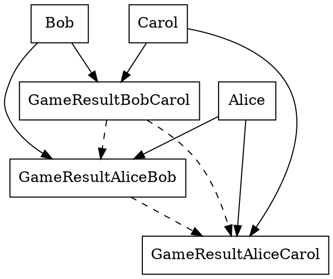

This is the result of the following executions:

1. Carol plays against Alice.
2. Alice plays against Bob.
3. Carol plays against Bob

```graphviz
digraph entries {
  node [
      shape ="record"
  ]

  GameResultAliceBob -> GameResultAliceCarol [style="dashed"]
  GameResultBobCarol -> {GameResultAliceBob, GameResultAliceCarol} [style="dashed"]
  Alice -> {GameResultAliceBob, GameResultAliceCarol}
  Bob -> {GameResultBobCarol, GameResultAliceBob}
  Carol -> {GameResultBobCarol, GameResultAliceCarol}
}
```
